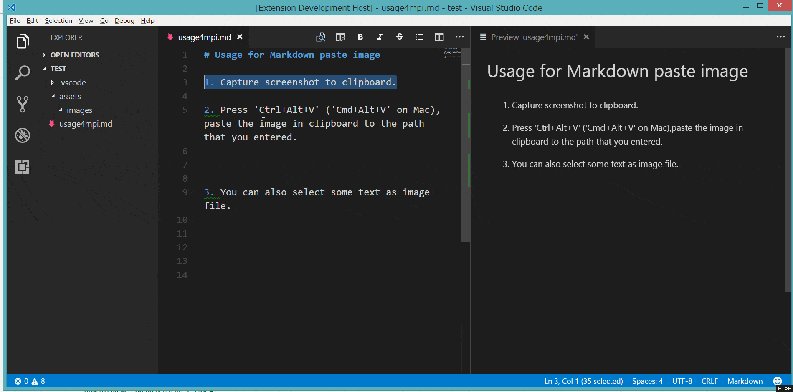

# Markdown Paste Image

Paste image directly from clipboard to markdown(or other file)!

**Support Mac/Windows/Linux!** And support config destination folder.

## Usage

1. Capture screen to clipboard
1. Open the command palette: `Ctrl+Shift+P` (`Cmd+Shift+P` on Mac)
1. Type: "Markdown Paste Image" or you can use default keyboard binding: `Ctrl+Alt+V` (`Cmd+Alt+V` on Mac).
1. Image will be saved in the folder that contains current editing file
1. The relative path will be paste to current editing file

## Config

- `pasteImage.path`

    the folder path that image will be saved. Support absolute path and relative path and variable ${workspaceRoot}.

    Default value is `./`, mean save image in the folder contains current file.

- `pasteImage.silence`

    enable/disable showing confirm box while paste image. Set this config option to `true`, filename confirm box will not be shown whill paste image.

    Default value is `false`

## Format

### File name format

If you selected some text in editor, then extension will use it as the image file name.
If not the image will be saved in this format: "Y-MM-DD-HH-mm-ss.png".

### File link format

When you editing a markdown, it will pasted as markdown image link format ``, the imagePath will be resolve to relative path of current markdown file. In other file, it just paste the image's path.

## FAQ

1. Extension not working on windows os.

   https://github.com/telesoho/vscode-markdown-paste-image/issues/6

## Contact

If you have some any question or advice, Welcome to [issue](https://github.com/telesoho/vscode-markdown-paste-image/issues)

## License

The extension and source are licensed under the [MIT license](LICENSE.txt).
