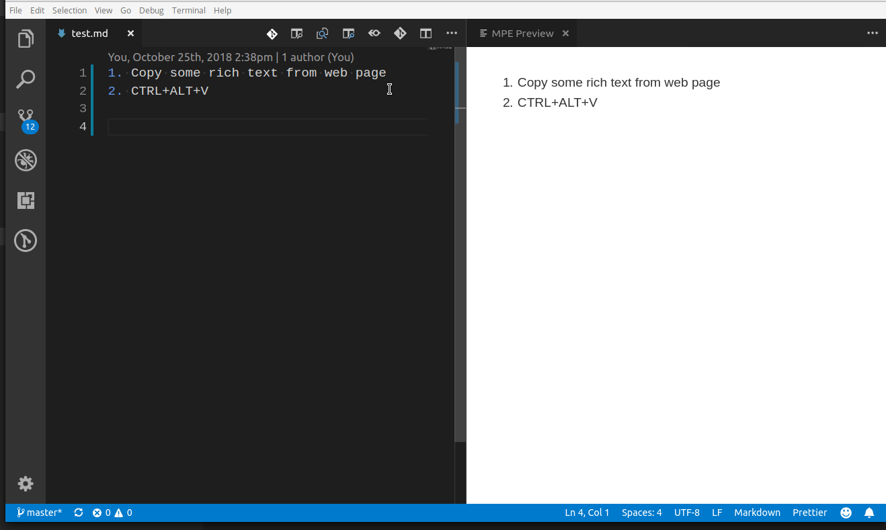
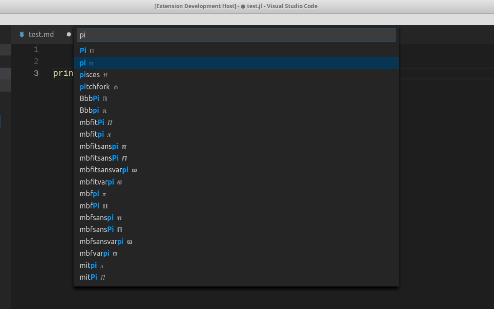

# Markdown Paste

Smartly paste for Markdown.

**Support Mac/Windows/Linux!**.


## Requirements

- 'xclip' command be required (Linux)
- 'powershell' command be required (Win32)
- 'pbpaste' command be required (Mac)

## Features

- Paste smart

  Smartly paste in Markdown by pressing 'Ctrl+Alt+V' ('Cmd+Alt+V' on Mac) or `Markdown Paste` command.

  - If you paste an image, the extension will create an new file for the image and insert link code to Markdown.
  - If you paste a text, it will test the text with customize regex, and replace matched content by regex.
  - If you paste a text contain HTML tag, it will try to convert the HTML content to Markdown.
  - If you paste a rich text, it will try to convert the rich text to Markdown.(Linux only)
    

- Download file

  Use `Markdown Download` command (Linux or Windows:`Ctrl+Alt+D`, Mac:`Cmd+Alt+D`) to download file and insert link code into Markdown.
  

- Paste code

  Use `Markdown Paste Code` command (Linux or Window:`Ctrl+Alt+C`, Mac:`Cmd+Alt+C`) to paste code with auto-detecting language.

- Ruby tag

  Also, if you want to write article for learning Asia language like Chinese or Japanese, ruby tag(for example:<ruby>聪明<rp>(</rp><rt>Cōngmíng</rt><rp>)</rp></ruby>) may be useful. Now a ruby tag snippet are prepare for you, select some text and press 'Ctrl+Alt+T'.

  ```HTML
  <ruby>聪明<rp>(</rp><rt>pronunciation</rt><rp>)</rp></ruby>
  ```

  This extension will not get the pronunciation for you in this version. You have to replace 'pronunciation' by yourself.

- Insert latex math symbol and emoji

  You can insert latex math symbol and emoji to any text file, such as Julia source file.

  Press 'Ctrl+Alt+\\' or input "Insert latex math symbol" in vscode command panel, then input latex symbol name and choose symbol you want.

  

- Embed base64 image

  While you paste image or download image, you can force the extension to insert embed base64 image to markdown by empty filename.

  

## Config

- Predefined variables

  - `${workspaceRoot}` - the path of the folder opened in VS Code
  - `${fileWorkspaceFolder}` - - the current opened file's workspace folder
  - `${fileBasename}` - the current opened file's base name
  - `${fileBasenameNoExtension}` - the current opened file's base name with no file extension
  - `${fileExtname}` - the current opened file's extension
  - `${fileDirname}` - the current opened file's directory name
  - `${datetime}` - the current date & time formatted by `"Y-MM-DD-HH-mm-ss"`

- `MarkdownPaste.path`

  The folder path that image will be saved. Support absolute path and relative path and predefined variables.

  Default value is `${fileDirname}`.

- `MarkdownPaste.nameBase`

  The string as the default image file name. Support predefined variables.

  Default value is `${datetime}`.

- `MarkdownPaste.namePrefix`

  The string prepend to the default image file name. Support predefined variables.

  Default value is `""`.

- `MarkdownPaste.nameSuffix`

  The string append to the default image file name. Support predefined variables.

  Default value is `""`.

- `MarkdownPaste.silence`

  Enable/disable showing confirm box while paste image. Set this config option to `true`, filename confirm box will not be shown while paste image.

  Default value is `false`.

- `MarkdownPaste.enableImgTag`

  Enable/disable using HTML img tag with width and height for pasting image. If this option be enabled, you can input width and height by using `<filepath>[?width,height]` in filename confirm input box. for example input `\abc\filename.png?200,100`, then `` will be inserted.

  Default value is `true`.

- `MarkdownPaste.encodePath`

  Encode path link to URL-encode format.

  - `encodeURI` Encode all characters to URL-encode format.
  - `encodeSpaceOnly` Encode `' '`(space) to `'%20'` only.
  - `none` Encode nothing.

  Default value is `encodeSpaceOnly`

- `MarkdownPaste.rules`

  If you want to define your own regex to parse and replace content for pasting text. You can fill the following JSON, and set it to this option.

  ```json
  [{
      // rule 1
      "regex": "(https?:\/\/.*)", // your javascript style regex
      "options": "ig",            // regex option
      "replace": "[]($1)"         // replace string
  },
  {
      // rule 2
      "regex": "(https?:\/\/.*)", // your javascript style regex
      "options": "ig",            // regex option
      "replace": "[]($1)"         // replace string
  },
  ...
  ]
  ```

  The extension will try to test text content by regex defined in this option, if matched it will replace content by using the TypeScript function string.replace().

  Default value is:

  ```json
  [
    {
      "regex": "^(?:https?://)?(?:(?:(?:www\\.?)?youtube\\.com(?:/(?:(?:watch\\?.*?v=([^&\\s]+).*)|))?))",
      "options": "g",
      "replace": "[](https://www.youtube.com/watch?v=$1)"
    },
    {
      "regex": "^(https?://.*)",
      "options": "ig",
      "replace": "[]($1)"
    }
  ]
  ```

  **NOTE** While pasting image, this option also apply to render image path link.

- `MarkdownPaste.lang_rules`

  As `MarkdownPaste.rules`, you can define rules for other language (for example: asciidoc).

  ```json
  [
    [
      {
        "asciidoc": [
          {
            "regex": "^(?:https?://)?(?:(?:(?:www\\.?)?youtube\\.com(?:/(?:(?:watch\\?.*?v=([^&\\s]+).*)|))?))",
            "options": "g",
            "replace": "image::https://img.youtube.com/vi/$1/0.jpg[link=\"https://www.youtube.com/watch?v=$1\"]"
          },
          {
            "regex": "^(https?://.*)",
            "options": "ig",
            "replace": "image::$1[linktext,300]"
          },
          {
            "regex": "(.*/media/)(.*)",
            "options": "",
            "replace": "image::$2[linktext,300]"
          }
        ]
      },
      {
        "markdownx": [
          {
            "regex": "^(?:https?://)?(?:(?:(?:www\\.?)?youtube\\.com(?:/(?:(?:watch\\?.*?v=([^&\\s]+).*)|))?))",
            "options": "g",
            "replace": "[](https://www.youtube.com/watch?v=$1)"
          },
          {
            "regex": "^(https?://.*)",
            "options": "ig",
            "replace": "[]($1)"
          }
        ]
      }
    ]
  ]
  ```

  **NOTE** If any language rule been matched, it will not apply `MarkdownPaste.rules` anymore.

## FAQ

1. Extension not working on Windows, nor on Mac.

   https://github.com/telesoho/vscode-markdown-paste-image/issues/6

## Contributing

See [the contribution guidelines](./CONTRIBUTING.md) for ideas and guidance on how to improve the extension. Thank you!

## License

The extension and source are licensed under the [MIT license](LICENSE.txt).
