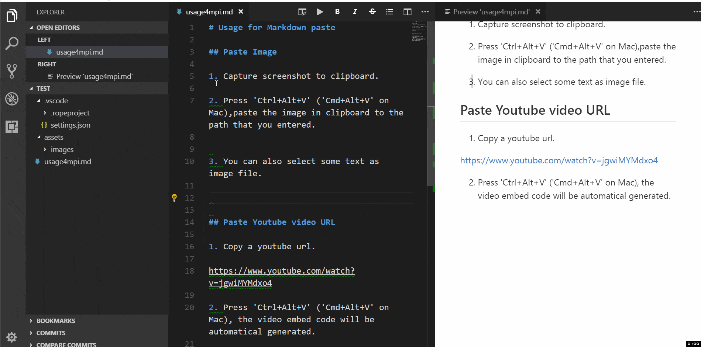
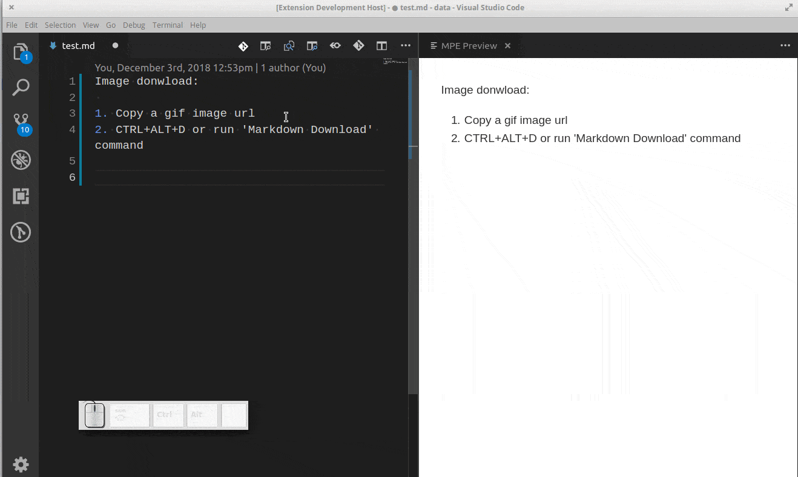
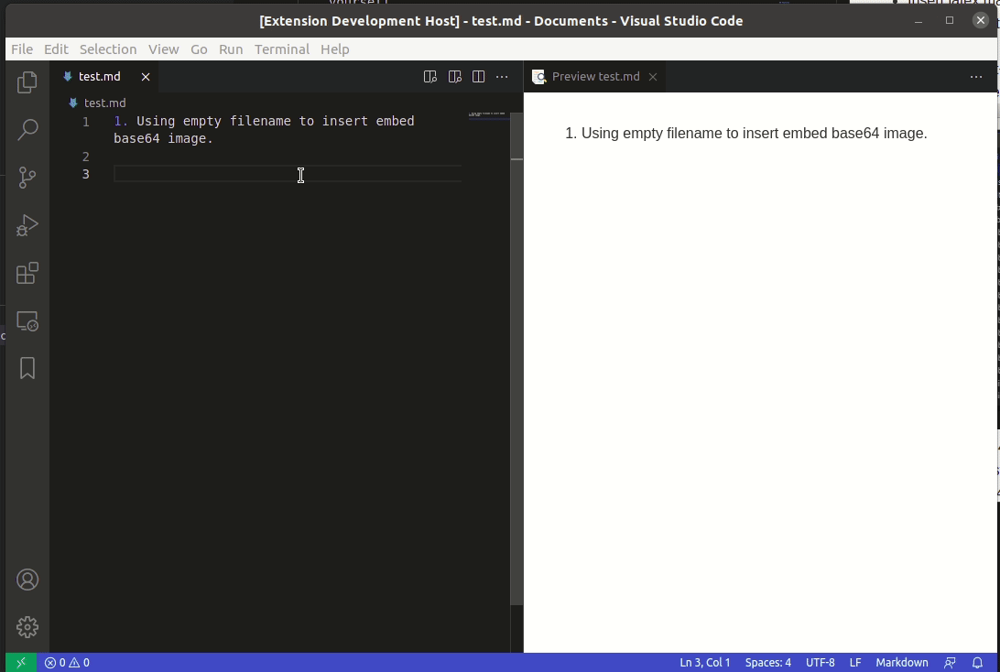

# Markdown Paste

Smartly paste for Markdown.

**Support Mac/Windows/Linux!**.



## Requirements

* 'xclip' command be required (Linux)
* 'powershell' command be required (Win32)
* 'pbpaste' command be required (Mac)

## Features

- Paste smart

    Smartly paste in markdown by pressing 'Ctrl+Alt+V' ('Cmd+Alt+V' on Mac)

    - If you paste an image, the extension will create an new file for the image and insert link code to Markdown.
    - If you paste a text, it will test the text with customize regex, and replace matched content by regex.
    - If you paste a text contain HTML tag, it will try to convert the HTML content to Markdown.
    - If you paste a rich text, it will try to convert the rich text to Markdown.(Linux only)
    

- Download file

    Use `Markdown Download` command (Linux or Windows:`Ctrl+Alt+D`, Mac:`Cmd+Alt+D`) to download file and insert link code into Markdown.
    


- Ruby tag

    Also if you want to write article for learning asian language like Chinese or Japanese, ruby tag(for example:<ruby>聪明<rp>(</rp><rt>Cōngmíng</rt><rp>)</rp></ruby>) may be useful. Now a ruby tag snippet are prepare for you, select some text and press 'Ctrl+Alt+T'.

    ```HTML
    <ruby>聪明<rp>(</rp><rt>pronunciation</rt><rp>)</rp></ruby>
    ```

    This extension will not get the pronunciation for you in this version. You have to replace 'pronunciation' by yourself.

- Insert latex math symbol and emoji

    You can insert latex math symbol and emoji to any text file, such as Julia source file.

    press 'Ctrl+Alt+\\' or input "Insert latex math symbol" in vscode command panel, then input latex symbol name and choose symbol you want.

    

- Embed base64 image

    While you paste image or download image, you can force the extention to insert embed base64 image to markdown by empty filename.

    for example:
    ```
     ./assets/                => 
     ./assets/?200,10         => 
    ```

    

## Config

- `MarkdownPaste.path`

    The folder path that image will be saved. Support absolute path and relative path and the following predefined variables

    - ${workspaceRoot} - the path of the folder opened in VS Code
    - ${fileBasename} - the current opened file's basename
    - ${fileBasenameNoExtension} - the current opened file's basename with no file extension
    - ${fileExtname} - the current opened file's extension
    - ${fileDirname} - the current opened file's dirname

    Default value is `./`, mean save image in the folder contains current file.

- `MarkdownPaste.silence`

    enable/disable showing confirm box while paste image. Set this config option to `true`, filename confirm box will not be shown while paste image.

    Default value is `false`


- `MarkdownPaste.enableImgTag`

    enable/disable using HTML img tag with width and height for pasting image. If this option be enabled, you can input width and height by using `<filepath>[?width,height]` in filename confirm input box. for example input `\abc\filename.png?200,100`, then `` will be inserted. 

    Default value is `true`

- `MarkdownPaste.encodePath`

    Encode path link to URL-encode format.

    - encodeURI Encode all characters to URL-encode format. 
    - encodeSpaceOnly Encode ' '(space) to '%20' only. 
    - none Encode nothing.


- `MarkdownPaste.rules`

    If you want to define your own regex to parse and replace content for pasting text. You can fill the following JSON, and set it to this option.
    ```JSON
    [{
        // rule 1
        "regex": "(https?:\/\/.*)", // your javascript style regex
        "options": "ig",            // regex option
        "replace": "[]($1)"         // replace string
    },
    {
        // rule 2
        "regex": "(https?:\/\/.*)", // your javascript style regex
        "options": "ig",            // regex option
        "replace": "[]($1)"         // replace string
    },
    ...
    ]
    ```

    The extension will try to test text content by regex defined in this option, if matched it whill replace content by using the TypeScript function string.replace().

    Default value is

    ```JSON
    [{
        "regex": "^(?:https?:\/\/)?(?:(?:(?:www\\.?)?youtube\\.com(?:\/(?:(?:watch\\?.*?v=([^&\\s]+).*)|))?))",
        "options": "g",
        "replace": "[](https://www.youtube.com/watch?v=$1)"
    },
    {
        "regex": "^(https?:\/\/.*)",
        "options": "ig",
        "replace": "[]($1)"
    }]

    ```

## Format

### File name format

If you selected some text in editor, then extension will use it as the image file name.
If not the image will be saved in this format: "Y-MM-DD-HH-mm-ss.png".

### File link format

When you editing a markdown, it will pasted as markdown image link format ``, the imagePath will be resolve to relative path of current markdown file. In other file, it just paste the image's path.

## FAQ

1. Extension not working on windows os.

   https://github.com/telesoho/vscode-markdown-paste-image/issues/6

## Contact

If you have some any question or advice, Welcome to [issue](https://github.com/telesoho/vscode-markdown-paste-image/issues)

## License

The extension and source are licensed under the [MIT license](LICENSE.txt).
